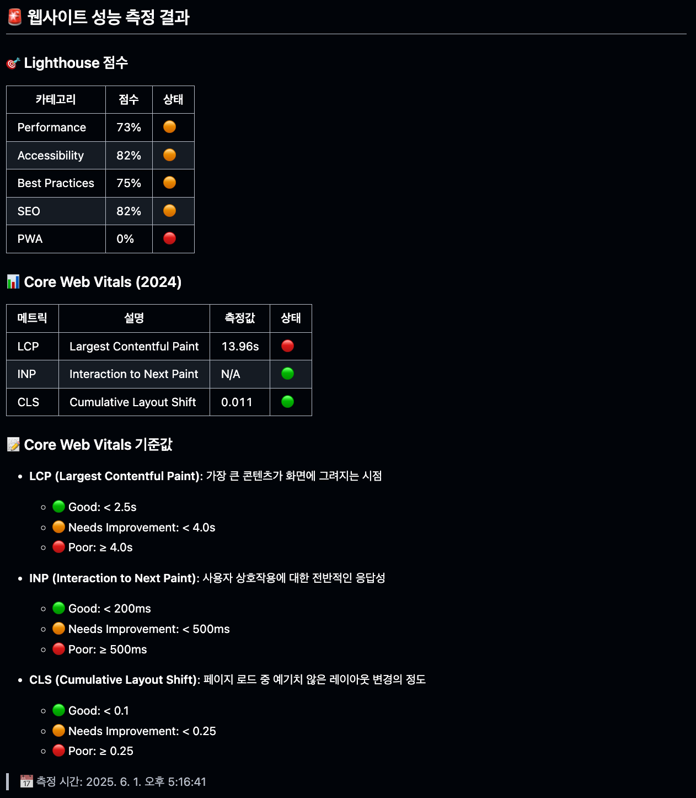
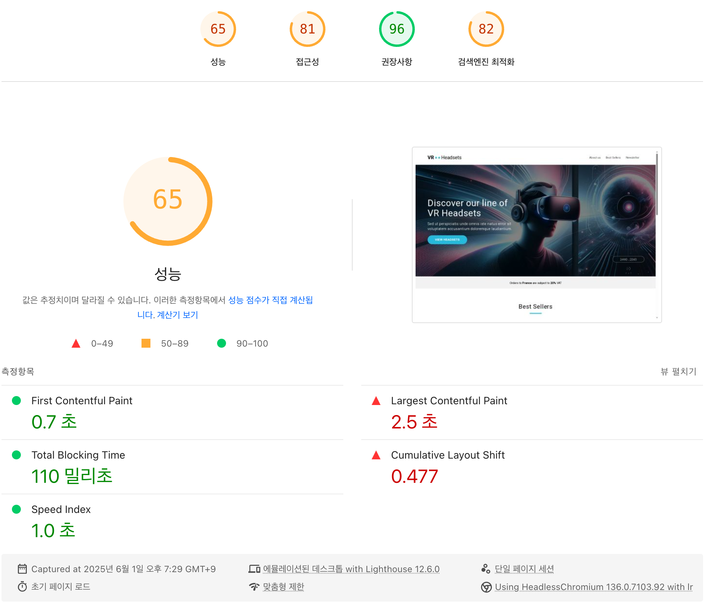
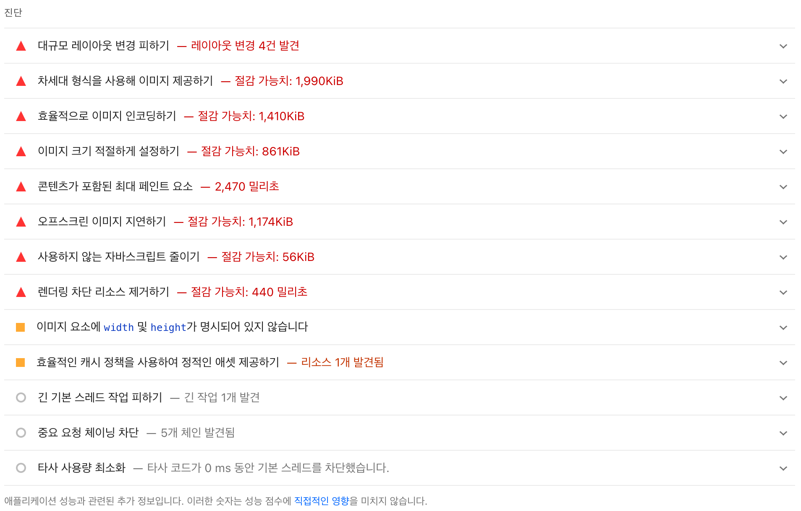
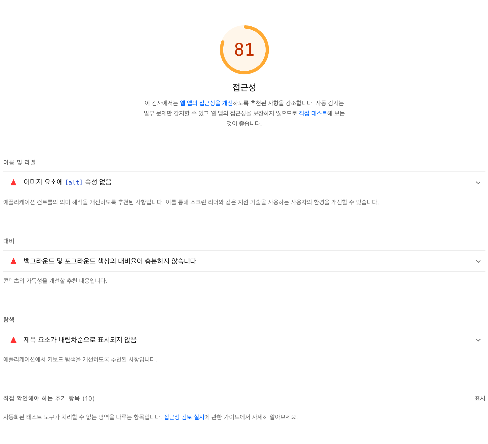
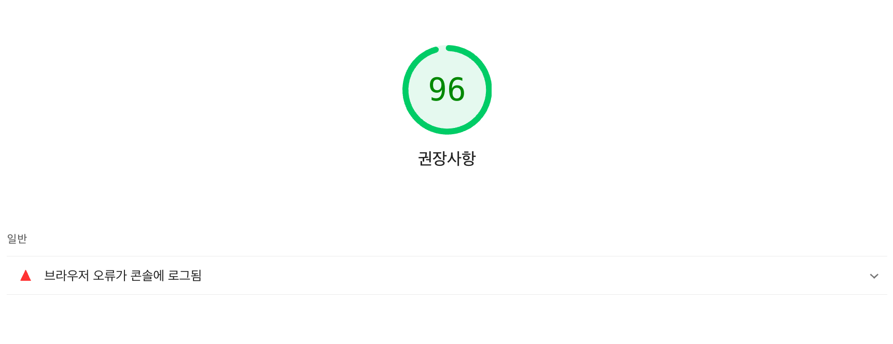
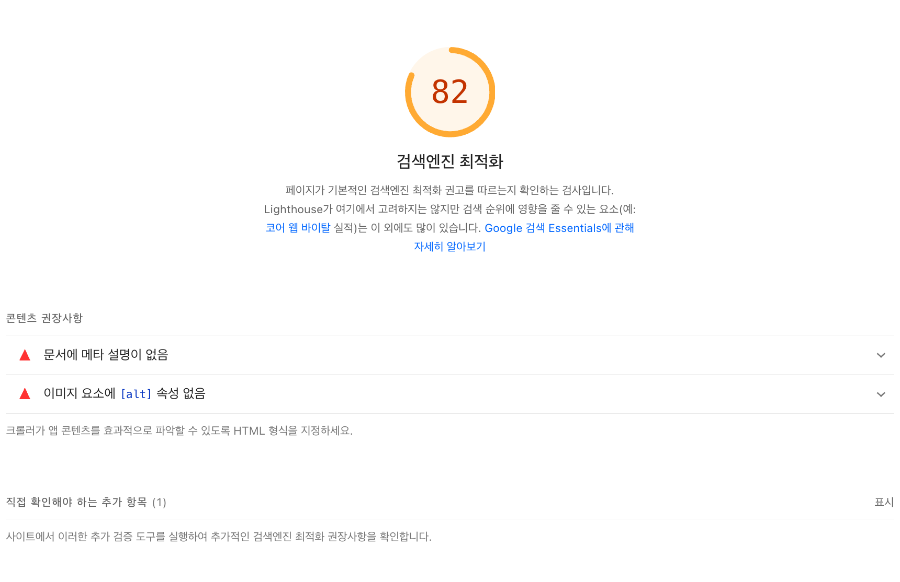

# 10주차 과제 - 코드 관점의 성능 최적화

## 배포 주소

> https://front-5th-chapter4-2-basic-chi.vercel.app/

## 성능 개선 보고서

### 최초 성능 보고서

#### lighthouse 성능 보고서

#### pagespeed 성능 보고서

> https://pagespeed.web.dev/analysis/https-front-5th-chapter4-2-basic-chi-vercel-app/264nupfzd1?form_factor=desktop

