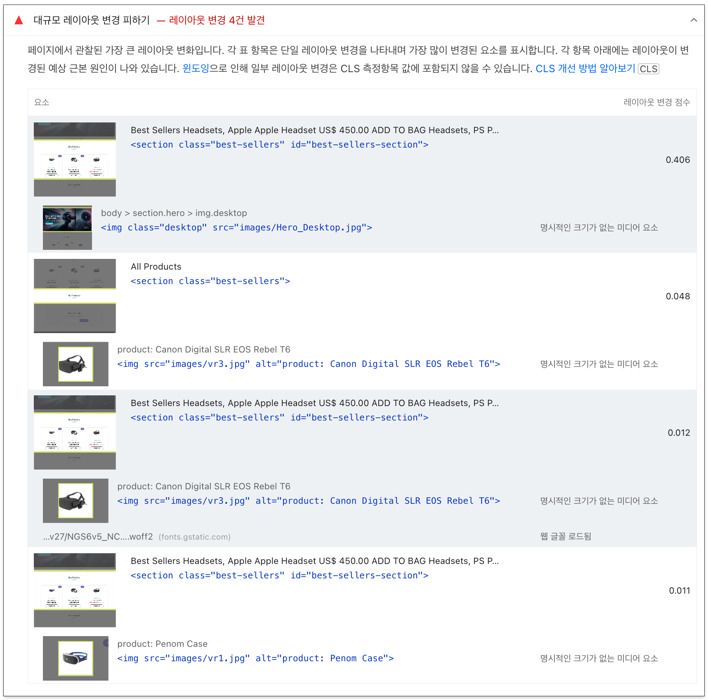
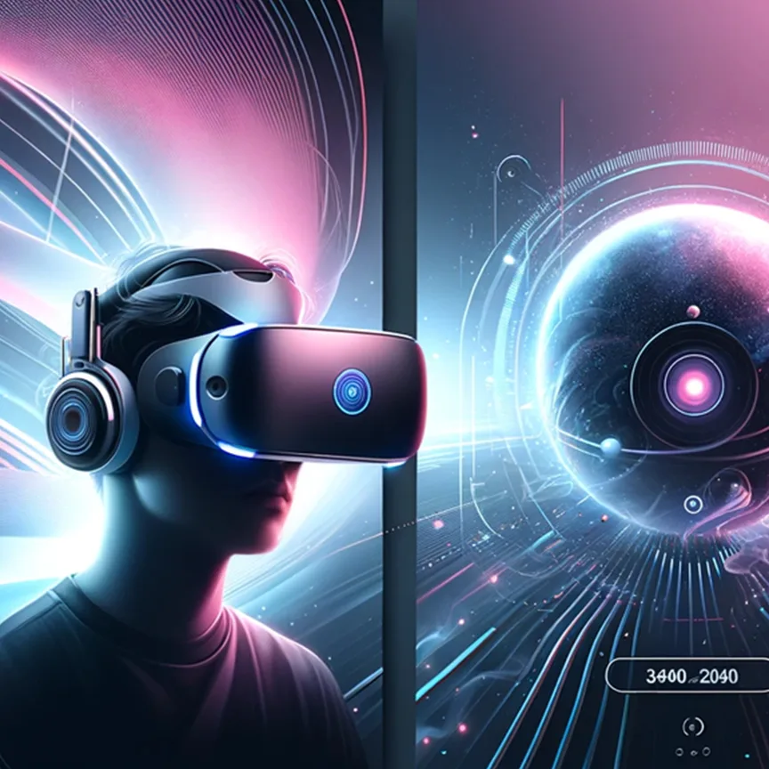
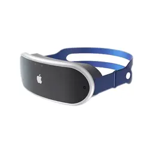
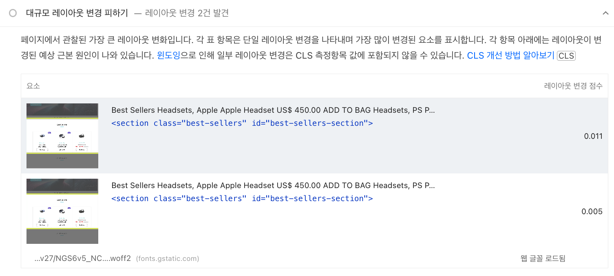
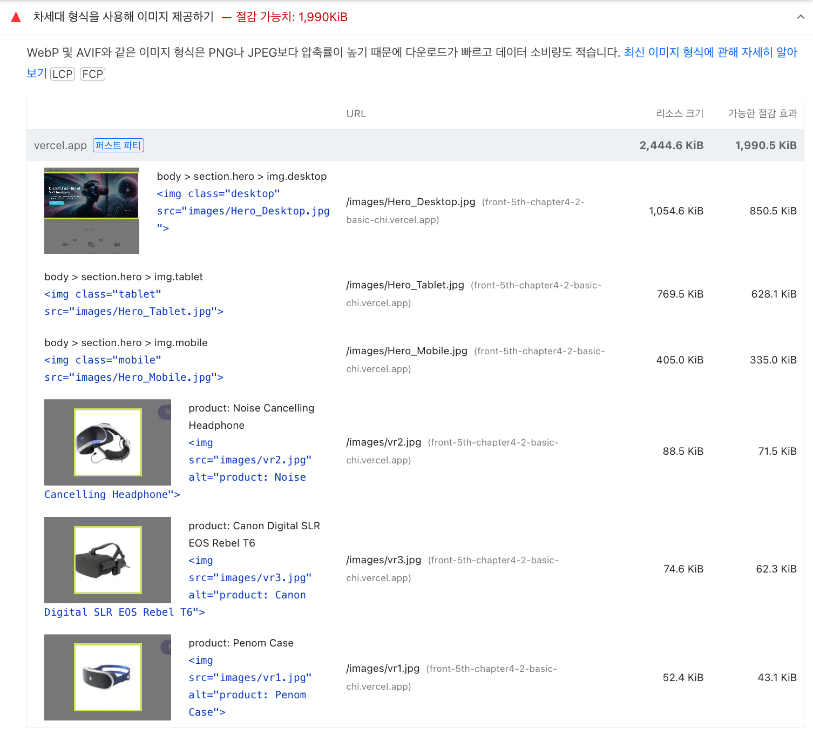
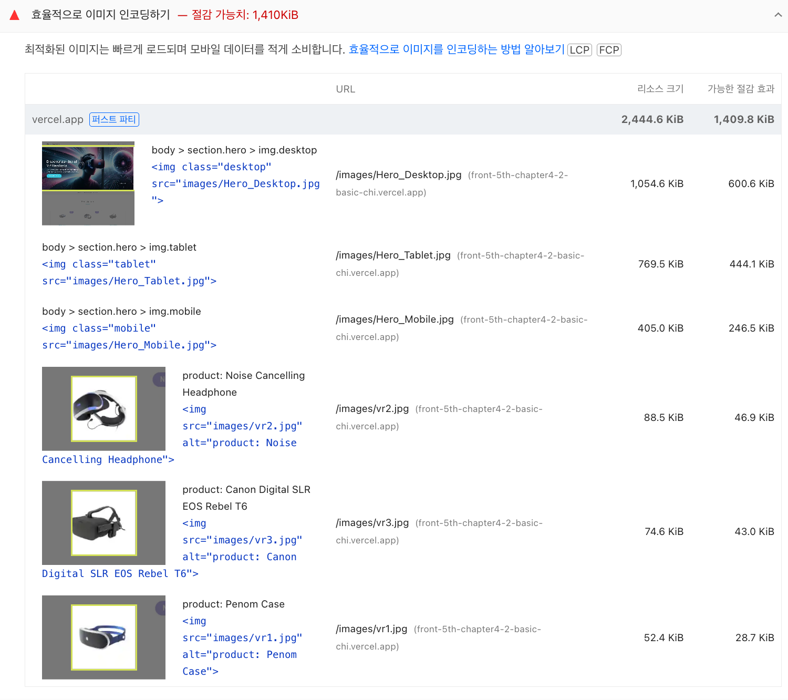
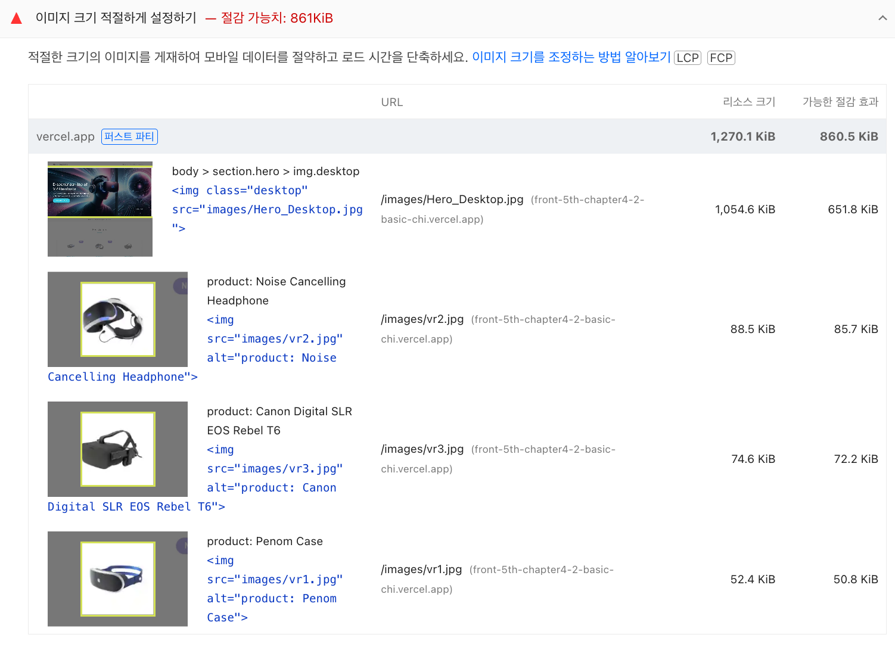
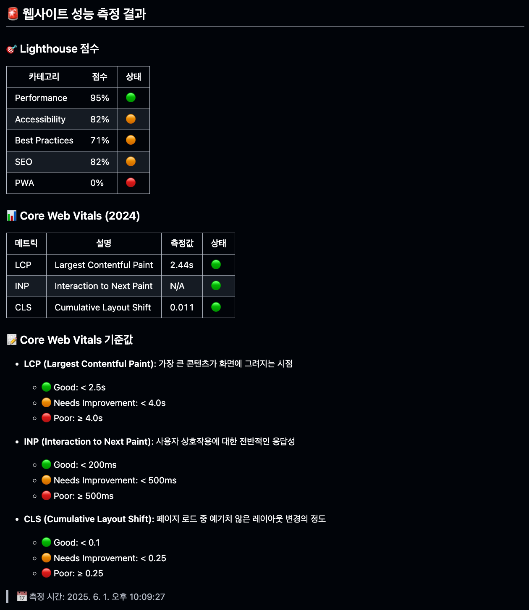
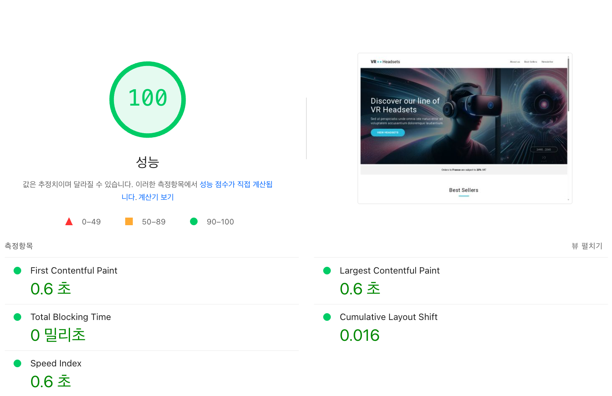
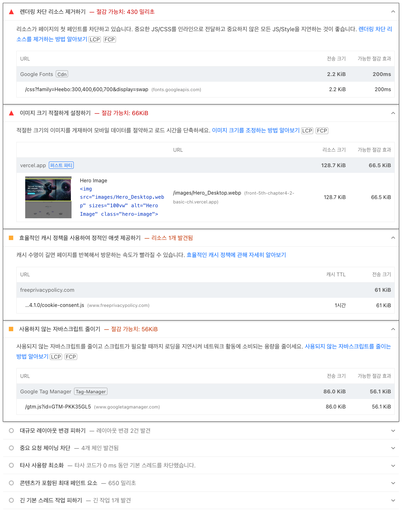

# 10주차 과제 - 코드 관점의 성능 최적화

## 배포 주소

> https://front-5th-chapter4-2-basic-chi.vercel.app/

## 최초 성능 보고서

### lighthouse 성능 보고서


### pagespeed 성능 보고서

> [최초 성능 보고서](https://pagespeed.web.dev/analysis/https-front-5th-chapter4-2-basic-chi-vercel-app/264nupfzd1?form_factor=desktop)


### pagespeed 기반 성능 개선

#### 1. 대규모 레이아웃 변경 피하기 (CLS) & 오프스크린 이미지 지연

> CLS (Cumulative Layout Shift)

- `페이지가 렌더링 중에 요소가 위치를 바꾸는 현상`을 측정하는 지표



> 초기 구조

```html
<section class="hero">
  
  
  
</section>
```

> 이슈 원인

- 기존 구조에서는 모든 `img` 가 `DOM` 에 남아 있었고, `CSS media query` 로 `display: none` 처리
- 브라우저는 초기 layout 계산 시 모든 `img` 를 고려
- `display: none` → `height` 공간 계산 안 됨 → 초기 레이아웃이 불안정하게 됨 → `CLS` 발생
- 또한 각 `img` 요소마다 명시적인 크기가 없음 → 브라우저가 이미지 크기를 추정해야 함 → 이미지 로드 시 크기가 변경될 수 있음 → `CLS` 발생

> 개선 구조

```html
<picture>
  <source srcset="images/Hero_Mobile.webp" media="(max-width: 576px)" />
  <source srcset="images/Hero_Tablet.webp" media="(max-width: 960px)" />
  
</picture>
```

```html

```

> 개선 효과

- `picture + source` 구조에서는 브라우저가 조건에 맞는 `source` 만 선택해서 로드
- 다른 이미지들은 아예 고려 하지 않음 (`display: none` 이 아님, `DOM` 에서 제외) → 초기 layout 계산이 안정적 → `CLS` 현상이 사라짐
- 각 `img` 요소에 `width` 와 `height` 를 명시적으로 설정해 브라우저가 이미지 크기를 추정하지 않도록 함



#### 2. 차세대 형식을 사용해 이미지 제공 & 효율적으로 이미지 인코딩하기





> 초기 이미지 파일

- 각 이미지 파일은 jpg 및 png 포맷으로 제공
- 파일 포맷 특성상 압축 효율이 낮고, 동일 품질 대비 파일 크기가 큼

> 개선 이미지 파일

- 모든 이미지 파일을 WebP 포맷으로 변환하여 제공
- WebP는 손실 및 무손실 압축 모두 지원하며, 동일 품질 기준으로 jpg, png 대비 훨씬 더 높은 압축 효율 제공

> 개선 효과

- WebP 형식은 동일한 이미지 대비 jpg 및 png 형식보다 파일 크기가 더 작음
- 이미지 파일 크기 감소로 네트워크 전송량이 줄어듦

#### 3. 이미지 크기 적절하게 설정하기



> 초기 이미지 파일

- 각 이미지 파일의 원본 해상도(원본 px 단위)가 렌더링 시 실제 표시 크기에 비해 과도하게 큼
- 브라우저는 필요한 렌더링 크기에 맞게 다운스케일링 처리하지만, 원본 전송량(네트워크 비용)은 그대로 발생
- 프로젝트 구조상 로컬 정적 파일(images 디렉토리 내 저장) 기반으로 관리되어 있어, 초기에는 별도의 사이즈 최적화가 적용되지 않은 상태였음

> 개선 이미지 파일

- 각 이미지 파일을 실제 렌더링 영역(visible size)을 고려한 적정 해상도로 리사이징
- 만약 CDN 서비스를 도입했다면 이미지 리사이징 API(예: width/quality 파라미터)를 통해 자동 최적화를 적용할 수 있었겠지만, 이번 프로젝트에서는 로컬 파일 기반인 점을 고려해 수동 리사이징 및 WebP 압축 최적화 방식으로 대응
- 결과적으로 렌더링 크기에 적합한 해상도로 이미지를 재생성하여 전송량을 줄임

> 개선 효과

- 이미지 크기를 줄임으로써 네트워크 전송량 감소 및 렌더링 속도 향상

#### 4. 콘텐츠가 포함된 최대 페인트 요소 (LCP)

> LCP (Largest Contentful Paint)

- 페이지가 렌더링 중에 가장 큰 요소가 렌더링 되는 시간을 측정하는 지표

> 문제 상황

- Lighthouse 분석 결과, `Hero Image`가 콘텐츠가 포함된 최대 페인트 요소 (LCP)로 측정됨
- 측정 시 전체 LCP 타이밍: 약 2470ms
- 구성 비율:

| 단계                 | 비율 | 시간   |
| -------------------- | ---- | ------ |
| TTFB                 | 7%   | 170ms  |
| 로드 지연            | 1%   | 20ms   |
| 로드 시간 (다운로드) | 71%  | 1760ms |
| 렌더링 지연          | 21%  | 520ms  |

> 개선 내용

- Hero Image preload 적용

  - Hero Image (Desktop / Tablet / Mobile) 각각에 대해 <link rel="preload"> 태그 적용
  - 브라우저가 이미지를 우선적으로 로드하도록 개선

```html
<link
  rel="preload"
  as="image"
  href="images/Hero_Desktop.webp"
  media="(min-width: 961px)"
/>
<link
  rel="preload"
  as="image"
  href="images/Hero_Tablet.webp"
  media="(min-width: 577px) and (max-width: 960px)"
/>
<link
  rel="preload"
  as="image"
  href="images/Hero_Mobile.webp"
  media="(max-width: 576px)"
/>
```

- Hero Image 구조 개선 (picture + source 사용)

  - 기존 `img` + `display: none` 방식에서 → `<picture> + <source>` 구조로 변경
  - 브라우저가 조건에 맞는 이미지 `source` 만 로드하도록 구조 변경 → `CLS` 및 `LCP` 개선

```html
<picture>
  <source srcset="images/Hero_Mobile.webp" media="(max-width: 576px)" />
  <source srcset="images/Hero_Tablet.webp" media="(max-width: 960px)" />
  
</picture>
```

- Critical CSS 적용 (`aspect-ratio` 적용)

  - Hero Image 에 `aspect-ratio` 적용하여 초기 레이아웃 시 `height` 공간 확보
  - 브라우저가 이미지 크기를 추정하지 않도록 함

```html
<style>
  .hero-image {
    width: 100%;
    height: auto;
    filter: brightness(50%);
    aspect-ratio: 2160 / 1005;
  }

  @media screen and (max-width: 960px) {
    .hero-image {
      aspect-ratio: 960 / 770;
    }
  }

  @media screen and (max-width: 576px) {
    .hero-image {
      aspect-ratio: 1 / 1;
    }
  }
</style>
```

- Cookie Consent JS defer 적용

  - `defer` 속성 추가 (HTML 파싱이 끝난 후 JS 실행)
  - HTML 파싱 후 실행 → `main thread block` 완화

```html
<script
  type="text/javascript"
  src="//www.freeprivacypolicy.com/public/cookie-consent/4.1.0/cookie-consent.js"
  charset="UTF-8"
  defer
></script>
```

## 개선 사후 보고서

### lighthouse 성능 보고서



### 최초 성능 보고서와 비교

| 지표 | 최초 성능 보고서 | 개선 사후 보고서 |
| ---- | ---------------- | ---------------- |
| LCP  | 13.96s           | 2.44s            |
| INP  | N/A              | N/A              |
| CLS  | 0.011            | 0.011            |

> `LCP` 지표 개선 효과

- `LCP` 지표가 2.44s로 초기 13.96s 대비 82.5% 개선됨
- 이는 초기 렌더링 시간이 크게 줄어들었음을 의미
- 브라우저가 이미지를 더 빠르게 로드하고 렌더링할 수 있음

> Performance (성능) 지표 개선 효과

- `Performance` 지표가 95점으로 개선됨
- 이는 성능 관련 모든 지표가 최적화되어 있음을 의미
- 사용자 경험 향상

### pagespeed 성능 보고서

> [개선 후 PageSpeed 성능 보고서](https://pagespeed.web.dev/analysis/https-front-5th-chapter4-2-basic-chi-vercel-app/uep47y3ih5?form_factor=desktop)





#### 최초 성능 보고서와 비교

| 항목                               | 개선 전 | 개선 후 | 변화               |
| ---------------------------------- | ------- | ------- | ------------------ |
| **총점**                           | 65점    | 100점   | +35점 상승         |
| **First Contentful Paint (FCP)**   | 0.7초   | 0.6초   | 개선 (0.1초 빠름)  |
| **Largest Contentful Paint (LCP)** | 2.5초   | 0.6초   | 개선 (1.9초 빠름)  |
| **Total Blocking Time (TBT)**      | 110ms   | 0ms     | 완전 해소          |
| **Cumulative Layout Shift (CLS)**  | 0.477   | 0.016   | 안정화 (대폭 개선) |
| **Speed Index**                    | 1.0초   | 0.6초   | 개선 (0.4초 빠름)  |

#### Largest Contentful Paint (LCP) 개선

- 개선 전: 2.5초 → 개선 후: 0.6초
- `Hero Image`에 `preload` 적용 + `WebP` 변환 + `Critical CSS` 적용 + `JS defer` 적용 등의 영향
- `Hero Image`의 `paint` 시점이 크게 앞당겨짐

#### Cumulative Layout Shift (CLS) 개선

- 개선 전: 0.477 (기준 초과, 매우 나쁨) → 개선 후: 0.016 (안정 영역)
- `Hero Image`에 `aspect-ratio` 적용 + `img` 구조 변경 (`<picture>` + `<source>` 사용)
- 레이아웃 시프트가 발생하지 않음

#### Total Blocking Time (TBT) 개선

- 개선 전: 110ms → 개선 후: 0ms
- `Cookie Consent JS` 를 `defer` 처리 → `main thread blocking` 원인 제거됨

#### First Contentful Paint (FCP), Speed Index 개선

- `FCP`: 0.7초 → 0.6초
- `Speed Index`: 1.0초 → 0.6초
- 이미지 최적화 + `preload` + 레이아웃 안정화 영향 → 초기 렌더링 빠르게 진행됨
